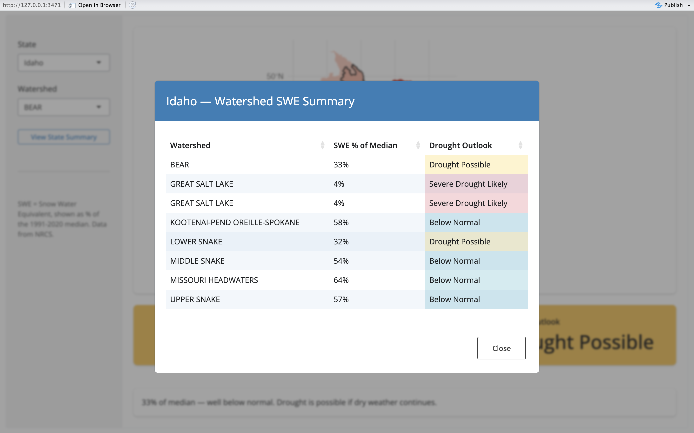
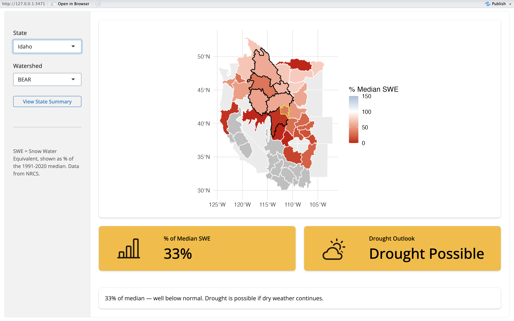

# Introduction:

This tool gives an immediate outlook on how a harvest and aquatic-recreational year will play out, as it uses snow water equivalent (SWE) data from 1991 to 2020 to then compare it to real time western SWE reports. Using this data from the Natural Resources Conservation Service (NRCS), I was able to construct a plot of the western United States and create watershed borders with USGS NHDPlus HUC4 code from an nhdplustools rstudio package. With this visualization I added the percent of median SWE data to overlay on the plot via a color scale and finally pushed towards completing the app.

To finalize my project I asked Posit AI Assistant to assist me with creating a compelling app, with the prompt "Make DroughtPrediction.qmd into a shiny app\[1\]." it took all of my sourced and completed code and produced my first draft off the app. After restructuring what had been created I also asked for the assistant to "create a toggle-able popup table, which when you select a state can give immediate information on all the relevant watersheds %SWE and drought likelihood." This finalized my project and completed my shiny app.

My question of interest was, "Can I produce a shiny app that will allow me to select state and watershed and using SWE data predict if drought will be likely in the coming year?" Thus wrangling the aforementioned sources I was able to join the data together via re-coding the names of stations and then applying the watershed and %SWE data over a plot of the United States.

With this project I furthered my abilities in data wrangling, visualization production, app creation, and understanding how to us artificial intelligence as a tool. By creating this app, I was able to provide relevant information that can be very useful to recreation and professional water goes, while also furthering my appreciation and love of environmental statistics. I look forward to continuing projects on ecological data and advancing my skills as a statistician.

# Code for Data Wrangling and Plot:

```{r}
library(shiny)
library(bslib)
library(bsicons)
library(ggplot2)
library(dplyr)
library(sf)
library(DT)
library(rvest)
library(nhdplusTools)
library(httr)
library(readr)

##Data Wrangling: 

# Step 1: Pull URL
url <- "https://wcc.sc.egov.usda.gov/reports/UpdateReport.html?report=Western+US"
page <- read_html(url)

# Step 2: Pull table
tables <- html_nodes(page, "table")
percentswe <- html_table(tables[[2]], fill = TRUE)
names(percentswe)[1] <- "name"

##Watershed Data Table (Assistance from AI to find this [1])
western_huc4 <- get_huc(
  id = c("1901","1902","1903","1904","1905","1906","1001","1002","1003","1004","1005","1006","1007","1008",
         "1301","1302","1303","1401","1402","1403","1404","1405","1406","1407",
         "1501","1502","1503","1504","1505","1506","1507","1508",
         "1601","1602","1603","1604",
         "1701","1702","1703","1704","1705","1706","1707","1708",
         "1801","1802","1803","1804","1805"),
  type = "huc04"
) 


# Basic US state background Data
us_states <- map_data("state")
western <- us_states |>
  filter(region %in% c("oregon","california","nevada","arizona",
                        "wyoming","colorado","utah","montana","idaho",
                        "washington","new mexico", "alaska"))
## I want to make my data into CSV to make it easier so just incase my code breaks this is my safety
write_csv(percentswe, "PercentSWE.csv")
write_csv(western_huc4, "westernhuc4.csv")

##Skipping the first two columns cleans my data also renaming
PercentSWE <- read.csv("PercentSWE.csv", skip = 2, header = FALSE, stringsAsFactors = FALSE)
colnames(PercentSWE) <- c("name", "SWE_sites", "SWE_pct_median", "precip_sites", "precip_pct_median", "region")

##Recoding WesternHuc4
western_huc4 <- western_huc4 |>
  mutate(name = toupper(name))

##Matching all the names [1]
PercentSWE <- PercentSWE |>
  mutate(name = case_when(
    name == "GUNNISON RIVER BASIN"                        ~ "GUNNISON",
    name == "UPPER COLORADO RIVER BASIN"                  ~ "COLORADO HEADWATERS",
    name == "YAMPA AND WHITE RIVER BASINS"                ~ "WHITE-YAMPA",
    name == "DIRTY DEVIL"                                 ~ "UPPER COLORADO-DIRTY DEVIL",
    name == "UPPER RIO GRANDE BASIN"                      ~ "RIO GRANDE HEADWATERS",
    name == "UPPER RIO GRANDE BASIN - New Mexico"         ~ "RIO GRANDE-ELEPHANT BUTTE",
    name == "MIMBRES RIVER BASIN"                         ~ "RIO GRANDE-MIMBRES",
    name == "GILA RIVER BASIN"                            ~ "UPPER GILA",
    name == "SALT RIVER BASIN"                            ~ "SALT",
    name == "LITTLE COLORADO RIVER BASIN"                 ~ "LITTLE COLORADO",        
    name == "SMITH, JUDITH, AND MUSSELSHELL RIVER BASINS" ~ "MISSOURI-MUSSELSHELL",
    name == "SUN, TETON AND MARIAS RIVER BASINS"          ~ "MISSOURI-MARIAS",
    name == "MISSOURI MAINSTEM RIVER BASIN"               ~ "MISSOURI-POPLAR",
    name == "MILK RIVER BASIN"                            ~ "MILK",
    name == "UPPER YELLOWSTONE RIVER BASIN"               ~ "UPPER YELLOWSTONE",
    name == "BIGHORN RIVER BASIN (WYOMING)"               ~ "BIG HORN",
    name == "SAN JUAN RIVER BASIN"                        ~ "UPPER COLORADO-DOLORES",
    name == "UPPER GREEN RIVER"                           ~ "GREAT DIVIDE-UPPER GREEN",
    name == "LOWER GREEN RIVER"                           ~ "LOWER GREEN",
    name == "LOWER SNAKE, WALLA WALLA"                    ~ "LOWER SNAKE",
    name == "UPPER HUMBOLDT RIVER"                        ~ "BLACK ROCK DESERT-HUMBOLDT",
    name == "BEAR RIVER"                                  ~ "BEAR",
    name == "ESCALANTE RIVER"                             ~ "ESCALANTE DESERT-SEVIER LAKE",
    name == "LOWER PEND OREILLE"                          ~ "KOOTENAI-PEND OREILLE-SPOKANE",
    name == "UPPER YAKIMA"                                ~ "YAKIMA",
    name == "CENTRAL COLUMBIA"                            ~ "MIDDLE COLUMBIA",
    name == "KLAMATH"                                     ~ "KLAMATH-NORTHERN CALIFORNIA COASTAL",
    name == "NORTHERN GREAT BASIN"                             ~ "GREAT SALT LAKE",        
    name == "SNAKE BASIN ABOVE PALISADES"                 ~ "UPPER SNAKE",            
    name == "SNAKE BASIN ABOVE AMERICAN FALLS"            ~ "MIDDLE SNAKE",
    name == "SOUTHEAST ALASKA BASIN"            ~ "SOUTHEAST ALASKA",
    name == "SOUTHEAST ALASKA BASIN"            ~ "SOUTH CENTRAL ALASKA",
    TRUE ~ name
  ))

##Remove * and ""

PercentSWE <- PercentSWE |>
  mutate(SWE_pct_median = as.numeric(gsub("\\*", "", SWE_pct_median)))

##Join 
df_joined <- western_huc4 |>
  left_join(PercentSWE, by = "name")


```

```{r}
# Plot - fill by SWE percent of median, gray for unmatched basins
ggplot() +
  geom_polygon(data = western, aes(x = long, y = lat, group = group),
               fill = "gray90", color = "white") +
  geom_sf(data = df_joined, aes(fill = SWE_pct_median),
          color = "steelblue", linewidth = 0.6) +
  geom_sf_text(data = df_joined, aes(label = name),
               size = 1.8) +
  scale_fill_gradient2(low = "red", mid = "white", high = "blue",
                       midpoint = 100,
                       na.value = "gray80",
                       name = "% of Median SWE") +
  coord_sf(xlim = c(-125, -102), ylim = c(30, 50)) +
  theme_minimal() +
  labs(title = "Western US HUC4 Watershed Basins - % of Median SWE")

##Observe no values are over 100, which is the midpoint and the median from the last 30 years.
```

Overall App  Table View  Selected State 

After exploring my app and data, drought is highly likely in the western United States this year. Due to decreased snowfall and lack of overall precipitation it will be imperative for dams to be opened to support ecosystems, agriculture, and human recreation.

# Conclusion:

To continue this project in the following year, I plan to attempt to recreate this app into something with greater capabilities than just shiny, and implement a river selector for each waterway in each watershed. With this selection I would like the viewer to be able to view real time hydro-graph date, which provides cubic feet per second flow in a given aquatic system. By being able to view all this pertinent information in one place, it would provide an invaluable resource for "River Soldiers", those who fight for the rights of water, and recreationists alike. Further I believe that this app could be used to inform the greater public of the mega-drought, and hopefully lead to national attention and intervention.

# Connection to Class:

Using class learned functions to pull from websites, join, rename, rewrite, create csv files, and make visualizations. I was able to use the tools that I learned over the past year of data science courses to create the bare bone essential pieces of my project. Furthermore I used shinyapp skills to structure an app that makes the entire process of interpreting the data instantaneous, allowing for the user to select their relevant state and watershed. Overall this project was crucial to my confidence in data science and I look forward to expanding my skills further.
